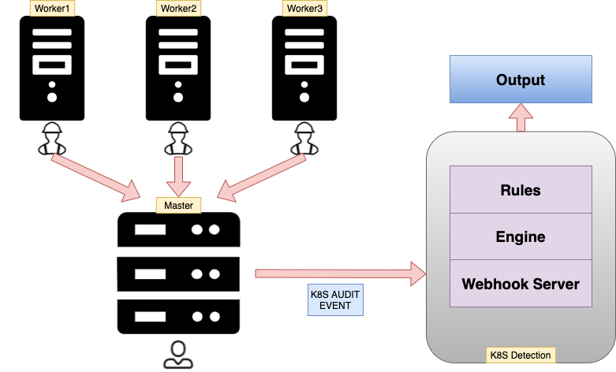

# k8s_scripts
 

* webhook server: 接收k8s集群事件
* engine: 将事件与规则一一匹配
* rules: k8s异常行为规则库

[1.环境搭建](docs/installation.md ':include :type=code')

[2.node操作](docs/node_manipulate.md ':include :type=code')

[3.pod操作](docs/pod_manipulate.md ':include :type=code')

[4.使能k8s_audit_log](docs/setup_k8s_audit.md ':include :type=code')

[5.使能webhook](webhook/README.md ':include :type=code')

[6.k8s异常行为PoC](poc/README.md ':include :type=code')
